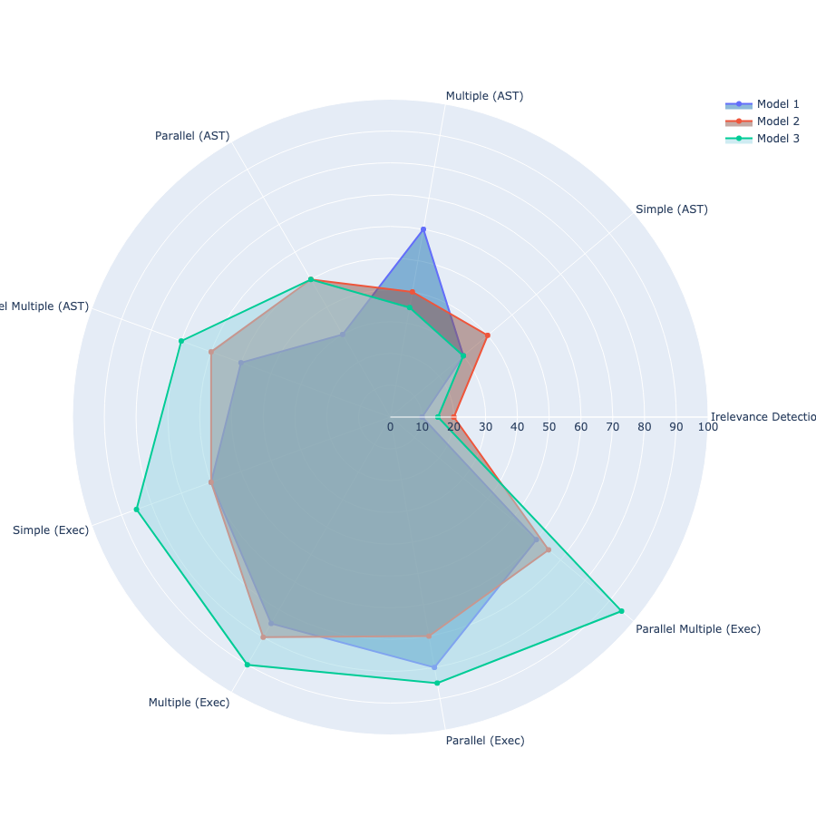

# Berkeley Function Call Leaderboard for ZHTW

Berkeley Function Call Leaderboard for Traditional Chinese (zh-tw) is a fork of the [Berkeley Function Calling Leaderboard](https://github.com/ShishirPatil/gorilla), designed to support localized functionality for a Traditional Chinese function calling benchmark, specifically tailored for use in Taiwan. 

# Introduction
As the adoption of Large Language Models (LLMs) grows, evaluating their task-performing abilities—such as real-time information retrieval and external API call execution—becomes increasingly important. LLM performance varies significantly based on the language used, the number of functions called, and the specific user prompts. To address this variability, we propose a robust function-calling benchmark tailored to selected languages and diverse test data formats, ensuring consistent and reliable performance assessment across different use cases.

# Background
Research has highlighted a significant performance gap between high-resource languages, like English, and low-resource languages, such as Traditional Chinese, in multilingual models. English dominates the pre-training corpus, making up 89.7%, while Chinese(Traditional and Simplfied) constitutes only 0.13%. Even with fine-tuning, Chinese models perform worse than their English counterparts, particularly in the Traditional context, where only 20% is in Traditional Chinese. This results in inaccuracies and underscores the need for culturally and linguistically aligned datasets.

To address these issues in evaluating function-calling performance in Traditional Chinese, Gorilla's benchmarking method was chosen for its advantages. Gorilla offers automated API generation and invocation, supporting over 1,000 different APIs with a 95% accuracy rate. It enhances efficiency by saving development time and reducing error risks, making it a robust choice for improving the accuracy and relevance of language models in specific cultural contexts.

# New Features
<b>Language Configuration</b> and <b>Radar Chart Drawing</b> are the two features we have introduced to enhance the benchmarking process. These enhancements not only broaden the applicability of the benchmark but also improve the usability and depth of analysis for researchers and developers working with large language models.
## Language Configuration
This feature allows users to switch between languages via the command line, making the tool more accessible and flexible for multilingual users. By integrating datasets in various languages, users can compare the performance of large language models across different linguistic contexts, offering valuable insights for multilingual language model development.
These enhancements not only broaden the applicability of the benchmark but also improve the usability and depth of analysis for researchers and developers working with large language models.

# Preliminary Preparation

## Install Dependencies

```bash
conda create -n BFCL python=3.10
conda activate BFCL
pip install -r requirements.txt
pip install vllm==0.4.3 # For vLLM supported GPUs
```

## Execution evaluation data post-processing (can be skipped: necesary for executable test categories)
Add your keys into `function_credential_config.json`, so that the original placeholder values in questions, params, and answers will be reset.

To run the executable test categories, there are 4 API keys to include:

1. RAPID-API Key: https://rapidapi.com/hub

    * Yahoo Finance: https://rapidapi.com/sparior/api/yahoo-finance15
    * Real Time Amazon Data : https://rapidapi.com/letscrape-6bRBa3QguO5/api/real-time-amazon-data
    * Urban Dictionary: https://rapidapi.com/community/api/urban-dictionary
    * Covid 19: https://rapidapi.com/api-sports/api/covid-193
    * Time zone by Location: https://rapidapi.com/BertoldVdb/api/timezone-by-location

    All the Rapid APIs we use have free tier usage. As a result, you need to subscribe to those API providers in order to have the executable test environment setup but it will be free of charge!

2. Exchange Rate API:https://www.exchangerate-api.com
3. OMDB API: http://www.omdbapi.com/apikey.aspx
4. Geocode API: https://geocode.maps.co/

The `apply_function_credential_config.py` will automatically search for dataset files in the default `./data/` directory and replace the placeholder values with the actual API keys.

## Evaluating different models on the BFCL

Make sure the model API keys are included in your environment variables. Running proprietary models like GPTs, Claude, Mistral-X will require them.

```bash
export OPENAI_API_KEY=sk-XXXXXX
export MISTRAL_API_KEY=XXXXXX
export FIRE_WORKS_API_KEY=XXXXXX
export ANTHROPIC_API_KEY=XXXXXX
export COHERE_API_KEY=XXXXXX
export NVIDIA_API_KEY=nvapi-XXXXXX
export YI_API_KEY=XXXXXX
```

If decided to run OSS model, the generation script uses vllm and therefore requires GPU for hosting and inferencing.

# Run Benchmark

## (1) Generating LLM responses

Use the following command for LLM inference of the evaluation dataset with specific models

```bash
python openfunctions_evaluation.py --model MODEL_NAME --test-category TEST_CATEGORY --language LANGUAGE
```

For available options for `MODEL_NAME`, `TEST_CATEGORY` and `LANGUAGE`, please refer to the the `model_handler/handler_map.py` file for a list of supported models, [Available Languages](#available-languages) section below and [Available Test Category](#available-test-category) section below.

If no `MODEL_NAME` is provided, the model `gorilla-openfunctions-v2` will be used by default. If no `TEST_CATEGORY` is provided, all test categories will be run by default. If no `LANGUAGE` is provided, `en` will be used by default.

### Available Languages
The following languages are currently supported for the benchmark:

- `en`: English (default)
- `zhtw`: Traditional Chinese

### Available Test Category
In the following two sections, the optional `--test-category` parameter can be used to specify the category of tests to run. You can specify multiple categories separated by spaces. Available options include all the test categories appearing on the wagon wheel by Berkeley Function-Calling Leaderboard's:

- `all`: Run all test categories listed under the individual test categories (9 in total).
    - This is the default option if no test category is provided.
- `ast`: Abstract Syntax Tree tests, including simple, parallel_function, multiple_function, parallel_multiple_function, and relevance
- `executable`: Executable code evaluation tests, including executable_simple, executable_parallel_function, executable_multiple_function, and executable_parallel_multiple_function
- Individual test categories:
    - `simple`: Simple function calls.
    - `parallel_function`: Multiple function calls in parallel.
    - `multiple_function`: Multiple function calls in sequence.
    - `parallel_multiple_function`: Multiple function calls in parallel and in sequence.
    - `executable_simple`: Executable function calls.
    - `executable_parallel_function`: Executable multiple function calls in parallel.
    - `executable_multiple_function`: Executable multiple function calls in sequence.
    - `executable_parallel_multiple_function`: Executable multiple function calls in parallel and in sequence.
    - `relevance`: Function calls with irrelevant function documentation.
- If no test category is provided, the script will run all available test categories. (same as `all`)

> By setting the `--api-sanity-check` flag, or `-c` for short, if the test categories include `executable`, the evaluation process will perform the REST API sanity check first to ensure that all the API endpoints involved during the execution evaluation process are working properly. If any of them are not behaving as expected, we will flag those in the console and continue execution.

### Dataset Composition
| #   | Category                   |
| --- | -------------------------- |
| 100 | Simple (Exec)              |
| 50  | Multiple (Exec)            |
| 50  | Parallel (Exec)            |
| 40  | Parallel & Multiple (Exec) |
| 400 | Simple (AST)               |
| 200 | Multiple (AST)             |
| 200 | Parallel (AST)             |
| 200 | Parallel & Multiple (AST)  |
| 240 | Relevance                  |


## (2) Evaluating the LLM generations

### Running the Checker

The basic syntax is as follows:

```bash
python eval_checker/eval_runner.py --model MODEL_NAME --test-category TEST_CATEGORY --language LANGUAGE
```

### Radar Chart
Inspired by Berkeley Function-Calling Leaderboard's interactive wagon wheel tool, we have created a charting feature, aiming to help users create visualization of the benchmark outcomes and better understand the performance by the models. This visualization tool helps users easily understand and compare the performance of different models, providing a clear, graphical representation of their strengths and weaknesses. This chart is organized into nine categories: Irelevance Detection, Simple (AST), Multiple (AST), Parallel (AST), Parallel Multiple (AST), Simple (Exec), Multiple (Exec), Parallel (Exec), and Parallel Multiple (Exec).

The basic syntax is as follows:
```bash
python chart/chart.py --score_csv ./score/zhtw/data.csv
```


## Contributor and License
